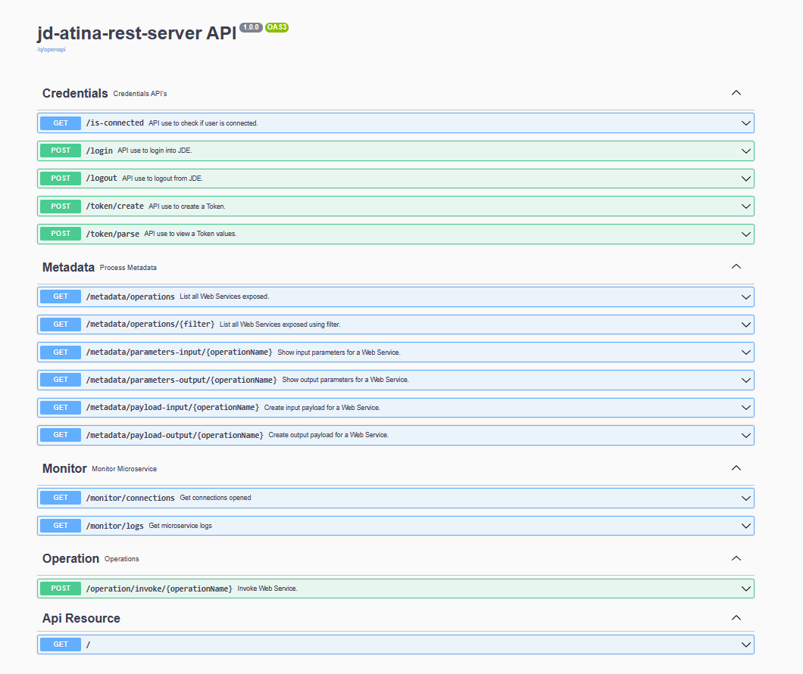
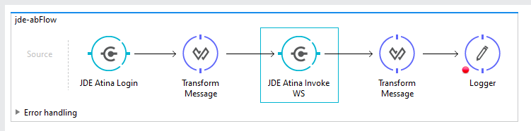
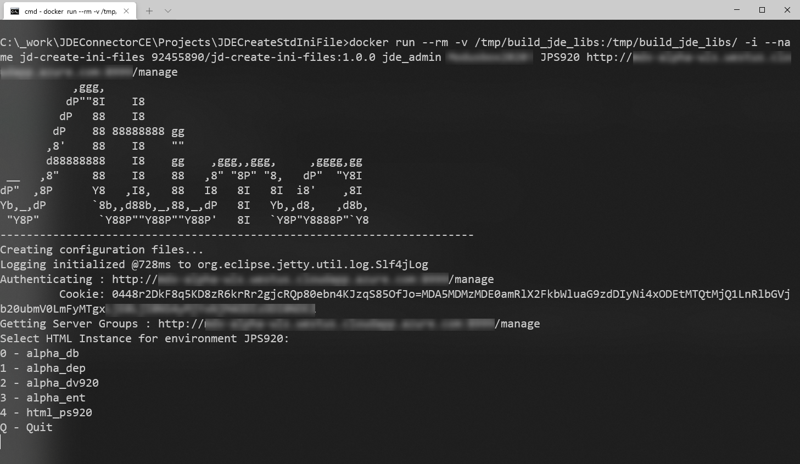

# JD ATINA Microservices

JD ATINA Microservices is made up of a series of the following services:

* JD Atina Web Service Microservice
* JD Atina Rest-API Microservice
* JD Atina Mule 3/4 CE Connector


## JD ATINA Web Service Microservice

It's a simple Microservice used to consume JDE Web Services directly to Enterprise Service Logic instead use JDE Applications Server.

It allows third party sofware to connect to JDE Web Services to share logic and data.

It provides:

* Access to JDE Web Services.

* Session management.

* Connection pooling.

* Metadata introspection.

## JD ATINA Rest API Microservice

It's a simple Microservice used to epose JDE Web Services as Rest API.

Any third party sofware with HTTP Connector can consume WS.



## JD Atina Mule 3/4 CE Connector

It's a Mule CE connector to consume Web Service from Mulesoft Applications.



## Implementations

The following implementation steps need to be performed before working with JD Web Service Microservice:

* Set up a configuration

* Start JD Web Services Microservice / JDE Rest API Microservice

* Install Mulesoft JDE WS Community Edition Connector 3.


## Prerequisites

 - Oracle JD Edwards EnterpriseOne HTML Client credential: User, Pasword, Environment and Role.

 - Oracle JD Edwards EnterpriseOne Server Manager credential: jde admin user, Pasword and url for Server Manager Ex. http://server:8999/manage/

 - Following folder inside JDE Deployment Server:
   - //Deplo/E920/MISC
   - //Deplo/E920/system/Classes
   - //Deplo/E920/system/JAS/webclient.ear/webclient.war/WEB-INF/lib
   - //Deplo/E920/DV920/java/sbfjars

 - [Docker](  https://docs.docker.com/get-docker/ "Docker"). JDE Web Service Microserver run under Docker container.

 
## Prerequisites to use JD Generate Configuration Files and JD Generate Jars Files Tools from java version. 

It not requires for docker version.

 - JDK 8 installed with JAVA_HOME configured appropriately

 - Apache Maven 3.8.1+.   

>  
                        Verify Maven is using the Java you expect
                        If you have multiple JDK’s installed it is not certain Maven will pick up the expected java and you could end up with unexpected results. 
                        You can verify which JDK Maven uses by running mvn --version.
 
 ## JD Generate Configuration Files Tool



JD WS Microservice needs the following ini files according to your environment:

* jdbj.ini

* jdeinterop.ini

* jdelog.properties

* tnsnames.ora" (for Oracle RDBMS based installations only)

You can configure it manually following JDE manuals or you can use this tools to help you.

This tool help to you to generate a base ini files. 

It takes all information from JDE Enterprise Server Manager using [REST API for Server Manager](https://docs.oracle.com/en/applications/jd-edwards/cross-product/9.2/eoira/ "REST API for Server Manager") 

The tooll will require to select the HTML Client instance according to your environment. 

You will need to review the jdeinterop.ini and jdbj.ini files before deploy it on JD WS Microservice.

JDE Guides:

* [Understanding jdeinterop.ini File]( https://docs.oracle.com/cd/E24705_01/doc.91/e24221/jdeinterop_java.htm#EOTCN00333 "Understanding jdeinterop.ini File")

### Using JAVA APP

It will require openjdk 8.

Download [JD Generate Configuration Files]( http://157.245.236.175:8081/artifactory/libs-release-local/com/atina/jd-create-ini-files/1.0.0/jd-create-ini-files-1.0.0-jar-with-dependencies.jar "Generator") - latest release: 

```
curl http://157.245.236.175:8081/artifactory/libs-release-local/com/atina/jd-create-ini-files/1.0.0/jd-create-ini-files-1.0.0-jar-with-dependencies.jar --output jd-create-ini-files-1.0.0-jar-with-dependencies.jar
```
### Run JD Generate Ini Files Tool
 
```bash
  java -jar jd-create-ini-files-1.0.0-jar-with-dependencies.jar [OPTIONS]

  OPTIONS:                                                                       
Options category 'startup':
  --debug [-d] (a string; default: "N")
    Debug Option
  --environment [-e] (a string; default: "")
    JDE Environment
  --password [-p] (a string; default: "")
    JDE Password for Enterprise Server Manager
  --server [-s] (a string; default: "")
    JDE URL of Server Manager
  --user [-u] (a string; default: "")
    JDE User for Enterprise Server Manager

```
Usage Exampes

```bash
java -jar jd-create-ini-files-1.0.0-jar-with-dependencies.jar -u jde_admin -p XXXXXXX -s http://server-manager:8999/manage -e JDV920

```

Output 

```bash
Folder : /tmp/build_jde_libs/JPS920 has been created

Authenticating : http://server-manager:8999/manage
         Cookie: 044GXl43PnHkTe1L3AMc/siNkFOIoll+S4ngsdGnNkS7Qg=MDA5MDE1MDE1amRlX2FkbWluMTM0LjIwOS4yMTEuMjQ4MTM0LjIwOS4yMTEuMjQ4MTYzNzYwNzAxMTIzOQ==
Getting Server Groups : http://server-manager:8999/manage

Select HTML Instance for environment JPS920:
0 - alpha_db
1 - alpha_dep
2 - alpha_dv920
3 - alpha_ent
4 - html_ps920
Q - Quit
4
Option Selected: 4

JDE Instance selected: html_ps920

Getting Instance Values: http://server-manager:8999/manage for Instance Name 'html_ps920'
 Processing File: jdbj.ini
 Processing File: jdeinterop.ini
 Processing File: jdelog.properties
 Processing File: settings.xml

------------------------------------------------------------------------
GENERATION SUCESSS
------------------------------------------------------------------------
 File: \tmp\build_jde_libs\JPS920\jdbj.ini generated
 File: \tmp\build_jde_libs\JPS920\jdeinterop.ini generated
 File: \tmp\build_jde_libs\JPS920\jdelog.properties generated
 File: \tmp\build_jde_libs\settings.xml generated
------------------------------------------------------------------------

```

It will create the following files:

```
build_jde_libs
      ├─ settings.xml
      ├─ JPS920
      ├─────├─ jdbj.ini
      ├─────├─ jdeinterop.ini
      └─────└─ jdelog.properties            
```

Adding manually "tnsnames.ora" for Oracle RDBMS based installations only.

### Using Docker

```bash
docker run --rm -v /tmp/build_jde_libs:/tmp/build_jde_libs/ -i --name jd-create-ini-files 92455890/jd-create-ini-files:1.0.0 jde_admin jde_password JPS920 http://servermanager.com:8999/manage
```


## JD Generate Jars Files

This tool will generate all jars files need it by JD Web Service Microservice.

### Installation

Download [JD Generate Jar Files]( http://157.245.236.175:8081/artifactory/libs-release-local/com/atina/jd-create-jar-files/1.0.0/jd-create-jar-files-1.0.0-jar-with-dependencies.jar "Generator") - latest release: 

```
curl http://157.245.236.175:8081/artifactory/libs-release-local/com/atina/jd-create-jar-files/1.0.0/jd-create-jar-files-1.0.0-jar-with-dependencies.jar --output jd-create-jar-files-1.0.0-jar-with-dependencies.jar
```

#### Preparing folders

Create **/tmp/jde-lib-bundle** folder with the following structure:

```
jde-lib-bundle
      ├─ JDBC_Vendor_Drivers
      └─ system
         │─ Classes 
         │─ JAS    
         └─ WS
 
```

Copy files from JDE Deploment Server to the corresponding folders:
  
        
| Destination                       | Source      |
| -------------------------- | ------------------ |
|JDBC_Vendor_Drivers               | //Deployment Server/E920/MISC/* |
|system->Classes                   | //Deployment Server/E920/system/Classes\*   |
|system->JAS                       | //Deployment Server/E920/system/JAS/webclient.ear/webclient.war/WEB-INF/lib/*|
|system->WS                        | //Deployment Server/E920\DV920/java/sbfjars/* |

 
#### Create Jars File

```bash
Usage: java -jar jd-create-jar-files-1.0.0-jar-with-dependencies.jar OPTIONS

Options category 'startup':
  --jdbcDriver [-j] (a string; default: "/tmp/build_jde_libs/JDBC_Vendor_Drivers")
    Enter JDBC Driver Folder
  --jdeInstallPath [-i] (a string; default: "/tmp/build_jde_libs/")
    Enter JDE Path installed
  --localRepo [-r] (a string; default: "")
    Enter Maven Local Repo
  --settings [-s] (a string; default: "")
    settings.xml to use Ex. /apache-maven-3.8.1/conf/settings.xml
  --version [-o] (a string; default: "1.0.0")
    Enter Version
```

#### How define local Repository (localRepo option)

Running this command you can get where the local repository is defined:

```bash
mvn help:evaluate -Dexpression=settings.localRepository
```

```bash
[INFO]
[INFO] ------------------< org.apache.maven:standalone-pom >-------------------
[INFO] Building Maven Stub Project (No POM) 1
[INFO] --------------------------------[ pom ]---------------------------------
[INFO]
[INFO] --- maven-help-plugin:3.2.0:evaluate (default-cli) @ standalone-pom ---
[INFO] No artifact parameter specified, using 'org.apache.maven:standalone-pom:pom:1' as project.
[INFO]
/root/.m2/repository  <=====================
[INFO] ------------------------------------------------------------------------
[INFO] BUILD SUCCESS
[INFO] ------------------------------------------------------------------------
[INFO] Total time:  3.301 s
[INFO] Finished at: 2021-11-22T20:31:42Z
[INFO] ------------------------------------------------------------------------
```

#### How configure global level settings.xml to have correct repositories. (settings option)

* Get Maven Home locaction:

```bash
mvn --version
```

```bash
Apache Maven 3.6.3
Maven home: /usr/share/maven  < ==============================
Java version: 1.8.0_292, vendor: Private Build, runtime: /usr/lib/jvm/java-8-openjdk-amd64/jre
Default locale: en, platform encoding: UTF-8
OS name: "linux", version: "5.4.0-73-generic", arch: "amd64", family: "unix"

```

In this example the setting is: *[Maven home]*  + *conf/settings.xml*
 
* Configure Setting.xml

By default, this process will use settings.xml created in the previous process.

You can configure you own settings.xml adding profile inside *\tmp\build_jde_libs\settings.xml*

Remember to configure this profile as default.

### Usage Generate Jars Files Exampes

Run following command:

(Note use previous steps to define -r and -s options )

```bash
java -jar jd-create-jar-files-1.0.0-jar-with-dependencies.jar -i /tmp/build_jde_libs/ -j /tmp/build_jde_libs/JDBC_Vendor_Drivers -r /root/.m2/repository/ -o 1.0.0 -s /tmp/build_jde_libs/settings.xml
```

Output 

```bash
------------------------------------------------------------------------
GENERATION SUCESSS
------------------------------------------------------------------------
JDE Library bundle has been copied to: /tmp/build_jde_libs/jde-lib-wrapped-1.0.0.jar
JDE WS has been copied to: /tmp/build_jde_libs/StdWebService-1.0.0.jar
------------------------------------------------------------------------
```

It will create the following files:

```
build_jde_libs
      ├─ jde-lib-wrapped-1.0.0.jar
      └─ StdWebService-1.0.0.jar

```

#### Deploy artifact to Local Repository - Optional

At startup, JD Microservice has the option to get these libraries from an internal repository.
This optional. 

In case you want to use a local repository, exectute the following command:

```
mvn deploy:deploy-file -DgroupId=com.jdedwards -DartifactId=jde-lib-wrapped -Dversion=1.0.0 -DrepositoryId=repo-central -Dpackaging=jar -Dfile=\tmp\build_jde_libs\jde-lib-wrapped-1.0.0.jar -Durl=http://localrepo:8081/artifactory/libs-release
mvn deploy:deploy-file -DgroupId=com.jdedwards -DartifactId=StdWebService -Dversion=1.0.0 -DrepositoryId=repo-central -Dpackaging=jar -Dfile=\tmp\build_jde_libs\StdWebService-1.0.0.jar -Durl=http://localrepo:8081/artifactory/libs-release
```


## Get and Run JD Microservice

### Installation

Download [JD Docker Composer Files]( http://157.245.236.175:8081/artifactory/libs-release/com/atina/jd-docker-files/1.0.0/jd-docker-files-1.0.0.zip "Docker Composer Files") - latest release: 

```
curl http://157.245.236.175:8081/artifactory/libs-release/com/atina/jd-docker-files/1.0.0/jd-docker-files-1.0.0.zip --output jd-docker-files-1.0.0.zip
```

Unzip JD Docker Composer Files (**jd-docker-files-1.0.0.zip**) downloaded in a temporal folder.

```bash
7z e jd-docker-files-1.0.0.zip
```

### Configuration

Edit .env file and change the following values:

#### Customer repository

Microservice Server

| Parameter                | Comment      | 
| -------------------------- | ------------------ |
|JDE_MICROSERVER_IP   |172.28.0.2|
|JDE_MICROSERVER_PORT |8077|
 
For Local repository:

| Parameter                | Comment      | 
| -------------------------- | ------------------ |
|CUSTOMER_REPOSITORY_PROTOCOL   |http|
|CUSTOMER_REPOSITORY_URL        |local-repository:8081/artifactory/libs-release|
|JDE_GET_LIB_WRAPPED_UPDATE_FROM_REPOSITORY|1|
|JDE_GET_LIB_WEB_SERVICE_FROM_REPOSITORY|1|

For non Local repository:

| Parameter                | Comment      | 
| -------------------------- | ------------------ |
|CUSTOMER_REPOSITORY_PROTOCOL   ||
|CUSTOMER_REPOSITORY_URL        ||
|JDE_GET_LIB_WRAPPED_UPDATE_FROM_REPOSITORY|0|
|JDE_GET_LIB_WEB_SERVICE_FROM_REPOSITORY|0|

#### dns defintion

| Parameter                | Comment      | 
| -------------------------- | ------------------ |
|JDE_MICROSERVER_ENTERPRISE_SERVER_NAME   |JDE-ENT|
|JDE_MICROSERVER_ENTERPRISE_SERVER_IP        |222.222.222.1|
|JDE_MICROSERVER_ENTERPRISE_DB_NAME|JDE-DB|
|JDE_MICROSERVER_ENTERPRISE_DB_IP|222.222.222.2|


### Create and Run JD Microservice

Run following docker commands:

Create Container

```bash
docker-compose -f docker-compose-dist.yml up --no-start
```

Copy files into Container

```bash
docker cp /tmp/build_jde_libs/JPS920 jd-atina-microserver:/tmp/jde/config
docker cp /tmp/build_jde_libs/jde-lib-wrapped-1.0.0.jar jd-atina-microserver:/tmp/jde
docker cp /tmp/build_jde_libs/StdWebService-1.0.0.jar jd-atina-microserver:/tmp/jde
```

Run Container

```bash
docker-compose -f docker-compose-dist.yml start
```

Check starting process

```bash
docker exec -it jd-atina-microserver cat /tmp/start.log
```

```bash
-SERVICE--------------------------------------------
   Name:  172.28.0.2
   Port:  8077
-REPOSITORY-----------------------------------------
   Customer:  http:157.245.236.175:8081/artifactory/libs-release
   Atina:     http:157.245.236.175:8081/artifactory/libs-release
-LIBRARIES------------------------------------------
   StdWebService Version  1.0.0
   jde-lib-wrapped Version 1.0.0
   JDEAtinaServer Version 1.0.0
-LICENSE--------------------------------------------
   Code:  demo
-MICROSERVER----------------------------------------
   JDE_MICROSERVER_TOKEN_EXPIRATION:  3000000
   JDE_MICROSERVER_ENTERPRISE_SERVER_NAME:  JDE-ENT
   JDE_MICROSERVER_ENTERPRISE_SERVER_IP:  122.21.23.261
   JDE_MICROSERVER_ENTERPRISE_DB_NAME:  JDE-DATABASE
   JDE_MICROSERVER_ENTERPRISE_DB_IP:  125.22.139.57
   JDE_MICROSERVER_MOCKING:  0
----------------------------------------------------
ADDITIONAL SCRIPT:
  127.0.0.1       localhost
  ::1     localhost ip6-localhost ip6-loopback
  fe00::0 ip6-localnet
  ff00::0 ip6-mcastprefix
  ff02::1 ip6-allnodes
  ff02::2 ip6-allrouters
  172.28.0.2      bcd05e8e5bd0
----------------------------------------------------
 Check log cat /tmp/jde/JDEConnectorServerLog/jd_atina_server_2021-11-18.0.log
```


```bash
docker exec -it jd-atina-microserver cat /tmp/jde/JDEConnectorServerLog/jde_atina_server_2021-11-18.0.log
```

```bash
19:27:06.713 [main] INFO  c.acqua.jde.jdeconnectorserver.JDEConnectorServer - Iniciando JDE Service Impl...
19:27:06.891 [main] INFO  c.a.jde.jdeconnectorserver.server.JDERestServer - *-------------------------------------*
19:27:06.892 [main] INFO  c.a.jde.jdeconnectorserver.server.JDERestServer - *   Starting JDE Microservice 1.0.0   *
19:27:07.061 [main] INFO  c.a.jde.jdeconnectorserver.server.JDERestServer - *   JDE Microservice started!         *
19:27:07.064 [main] INFO  c.a.jde.jdeconnectorserver.server.JDERestServer - *-------------------------------------*
```

The other way to see the logs is the following command:

```bash
docker logs jd-atina-microserver
```


 
## JDE Check JD Microservice
 
This tool is used to test JD Microservice. 
It will invoke a simple WS.

### Installation

Download [JD Check JD Microservice]( http://157.245.236.175:8081/artifactory/libs-release-local/com/atina/jd-check-microservice/1.0.0/jd-check-microservice-1.0.0-jar-with-dependencies.jar "Generator") - latest release: 

```
curl http://157.245.236.175:8081/artifactory/libs-release-local/com/atina/jd-check-microservice/1.0.0/jd-check-microservice-1.0.0-jar-with-dependencies.jar --output jd-check-microservice-1.0.0-jar-with-dependencies.jar
```
### Run JD Check Microservice
 
```bash
Usage: java -jar jd-check-microservice OPTIONS

   Options category 'startup':

  --mode [-m] (a string; default: "TestLoggindAndGetAddressBookWS")
    Modes
  --user [-u] (a string; default: "")
    JDE User
  --password [-w] (a string; default: "")
    JDE Password
  --environment [-e] (a string; default: "")
    JDE Environment
  --role [-r] (a string; default: "")
    JDE Role
  --serverName [-s] (a string; default: "")
    JD Micreserver Name or IP
  --serverPort [-p] (a string; default: "")
    JD Micreserver Port
  --addressbookno [-a] (a string; default: "")
    Address Book No

```
Usage Exampes

```bash
java -jar jd-check-microservice-1.0.0-jar-with-dependencies.jar -u JDE -w XXXXXX -e JDV920 -r *ALL -s localhost -p 8077 -m TestLoggindAndGetAddressBookWS -a 28
```

Output 

```bash
Checking Microservice...
user=JDE, environment=JDV920, role=*ALL, serverName=192.168.99.100, serverPort=8077, mode=TestLoggindAndGetAddressBookWS, addressbookno=1, sessionId=, transactionId=
Transaction ID: 20211122124518
User User: JDE in environment JDV920 with *ALL connected with Session ID [-1636010069]
WS JP010000.AddressBookManager.getAddressBook has been called correctly
Logout [0]
------------------------------------------------------------------------
CHECK SUCESSS
------------------------------------------------------------------------
User User: JDE in environment JDV920 with *ALL connected with Session ID -1636010069
Address Book Name: Financial/Distribution Company --
User User: JDE in environment JDV920 with *ALL disconnected. Current session ID 0
------------------------------------------------------------------------
``` 
## Install Mulesoft JDE WS CE Connector

The Atina JDE Web Service Connector CE provides interoperability with Oracle’s JD Edwards EnterpriseOne™ it allow consume all JDE Web Services published

### Installation

Download [ Atina JDE Web Service Connector CE]( http://157.245.236.175:8081/artifactory/libs-release/com/atina/jd-atina-connector/1.0.0/jd-atina-connector-1.0.0.zip "Generator") - latest release: 

```
curl  http://157.245.236.175:8081/artifactory/libs-release/com/atina/jd-atina-connector/1.0.0/jd-atina-connector-1.0.0.zip -o jd-atina-connector-1.0.0.zip
```

Install From the Studio Help Menu:

* Click Help > Install New Software.

* Click Add > Then, click Archive.. and select jd-atina-connector-1.0.0.zip downloaded

* Expand a Community Category and click the checkbox for the connector to install.

* Click Next, Next, I accept the terms of the license agreement, Finish, and restart Studio when prompted.

* From a Mule Project in Studio, search for the connector and drag it to the Canvas.


## JD Docker Composer Files - Environment .env detail
 
### Atina Repository

This repository is used to get updates for JD Microservice.

| Parameter                | Comment      | 
| -------------------------- | ------------------ |
|ATINA_REPOSITORY_PROTOCOL   |Atina repository Protocol|
|ATINA_REPOSITORY_URL        |Atina repository URL |


This is the customer repository is used to artifact:
This is optional.


| Parameter                | Comment      | 
| -------------------------- | ------------------ |
|CUSTOMER_REPOSITORY_PROTOCOL|//Deployment Server/E920/system/JAS/webclient.ear/webclient.war/WEB-INF/lib/*|
|CUSTOMER_REPOSITORY_URL     | //Deployment Server/E920\DV920/java/sbfjars/* |